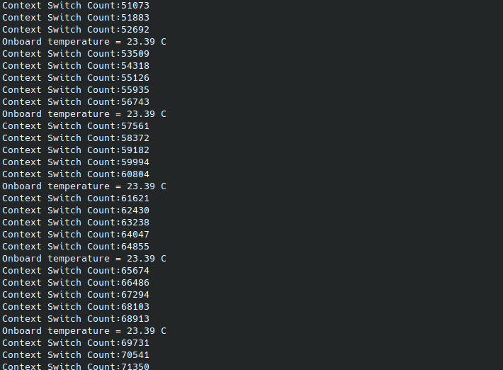

# Rtos_course_project

Implement FreeRTOS on ARM, add a context switching counter to the Kernel source code and print it.

#Note

Pico sdk path and FreeRTOS Kernel paths are set as environment variables.
Setting them is required for CMake to build the project.

